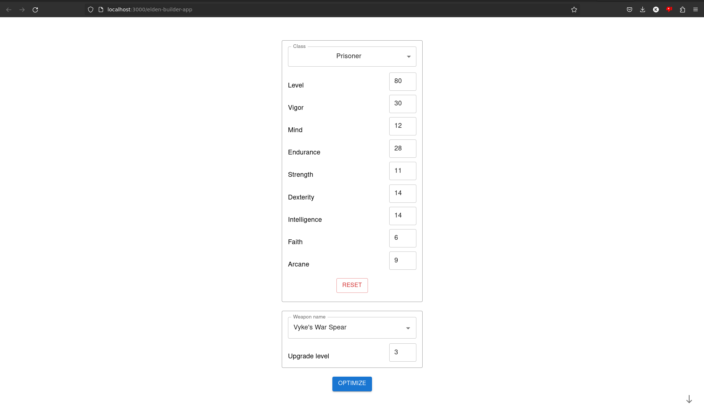
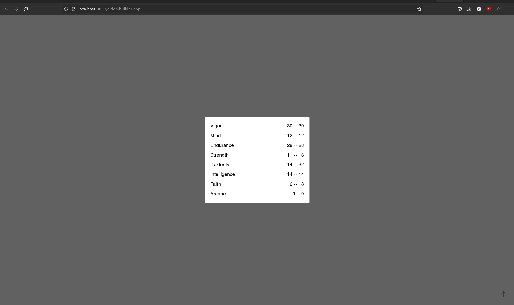

# Elden Builder

_Elden Builder uses a Rust backend with SQLite and Axum, and a React-Typescript frontend_.

Are you tired of having to figure out which level to upgrade in Elden Ring? Are you bored of the technicalities of soft caps and weapons scalings? Elden Builder is the solution.

Elden Builder is a web tool that allows you to enter your Elden Ring statlist, the weapon you want to use, and the level you're aiming for. Want to use Ruin's Greatsword, but you started Prisoner and already have a bunch of levels? Elden Builder will put you on the right track.

### Enter your (desired) stats:

### See how you statlist is optimized:

## Upcoming changes
- [ ] Integrate end result statlist into starting page
- [ ] Show how to upgrade per-level
